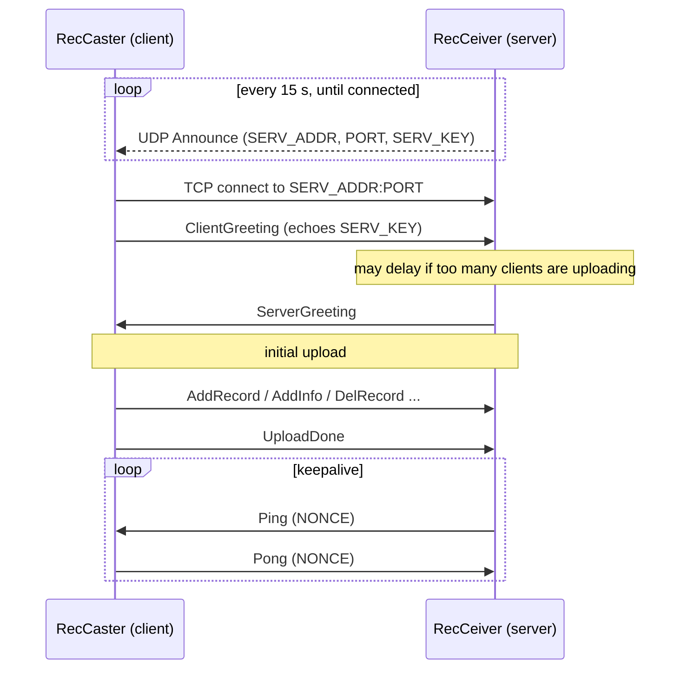
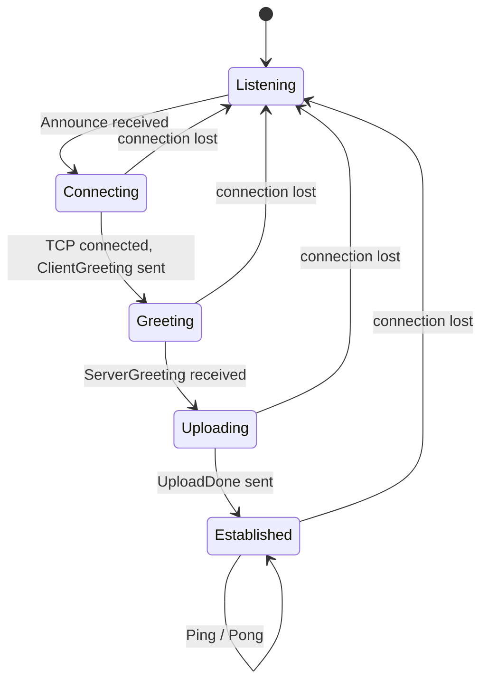

# RecSync Protocol Specification

RecSync is a discovery-and-upload protocol that lets one or more **RecCeiver**
servers maintain a complete, live list of the [EPICS] process-variable records
provided by each connected **RecCaster** client (an EPICS IOC). A server
advertises itself by UDP broadcast; a client that hears the advertisement opens a
TCP connection, uploads its records and metadata, and is then kept alive with a
periodic ping/pong exchange.

This document is the normative description of the wire protocol. The reference
implementation is the Python package [`recceiver.protocol`](server/recceiver/protocol/)
(the RecCeiver server); it is the single source of truth for any ambiguity here.
A second, independent implementation exists in the Rust [`recsync-rs`] `wire`
crate.

The key words MUST, MUST NOT, SHOULD, and MAY are used as in [RFC 2119].

[EPICS]: https://epics-controls.org/
[RFC 2119]: https://www.rfc-editor.org/rfc/rfc2119
[`recsync-rs`]: https://github.com/ChannelFinder/recsync-rs

## Terminology

| Term | Meaning |
|------|---------|
| RecCaster | The client. An EPICS IOC support module that uploads its records. |
| RecCeiver | The server. A daemon that collects records from many casters. |
| Record | A single PV instance: a record id, a record type, and a name. |
| Alias | An alternate name for a previously-added record. |
| Info | A key/value metadata pair attached to a record, or to the IOC as a whole. |

## Conventions

- All multi-byte integer fields are **big-endian** (network byte order).
- All string fields are UTF-8 and MUST NOT contain a NUL (`0x00`) byte.
- Fields labelled **reserved** MUST be set to zero by the sender. A receiver
  MUST reject a message whose reserved field is non-zero, except where this
  document states the field is merely *ignored*.
- Fields labelled **ignored** MAY hold any value; a receiver MUST NOT interpret
  them.
- Receivers MUST be prepared to accept and ignore extra bytes appended after the
  defined body of any message.

## Transport

RecSync uses two transports:

- **UDP**, port **5049** — the server broadcasts [Announce](#udp-announce-packet)
  packets to advertise its TCP endpoint. The reference server broadcasts to
  `255.255.255.255:5049` every 15 seconds.
- **TCP** — once a client has learned an endpoint from an Announce, it connects
  and exchanges the [framed messages](#tcp-message-framing) defined below.

## Connection lifecycle



The client connection progresses through the following states:



Rules:

1. The client passively listens for Announce packets. On connecting it MUST send
   [ClientGreeting](#0x0001-clientgreeting) immediately, then wait for the
   [ServerGreeting](#0x8001-servergreeting) before sending anything further.
2. The server MAY delay the ServerGreeting if too many clients are currently
   uploading.
3. After receiving the ServerGreeting the client sends its records and metadata
   as [AddRecord](#0x0003-addrecord), [AddInfo](#0x0006-addinfo), and
   [DelRecord](#0x0004-delrecord) messages, and signals completion of the initial
   upload with [UploadDone](#0x0005-uploaddone). It may continue to send these
   messages afterward as its database changes.
4. After UploadDone the server periodically sends [Ping](#0x8002-ping); the client
   MUST respond to each with a [Pong](#0x0002-pong) carrying the same nonce. A
   server MAY close a connection whose client does not respond promptly.
5. If the connection is lost the client returns to listening for Announce
   packets.

## UDP announce packet

An Announce packet is 16 bytes. When broadcast to an IPv4 address the packet
MAY be longer; clients process only the first 16 bytes and ignore any remainder.

```
 0                   1                   2                   3
 0 1 2 3 4 5 6 7 8 9 0 1 2 3 4 5 6 7 8 9 0 1 2 3 4 5 6 7 8 9 0 1
+-+-+-+-+-+-+-+-+-+-+-+-+-+-+-+-+-+-+-+-+-+-+-+-+-+-+-+-+-+-+-+-+
|           PROTO_ID            |        RESERVED (= 0)         |
+-+-+-+-+-+-+-+-+-+-+-+-+-+-+-+-+-+-+-+-+-+-+-+-+-+-+-+-+-+-+-+-+
|                       SERV_ADDR (IPv4)                        |
+-+-+-+-+-+-+-+-+-+-+-+-+-+-+-+-+-+-+-+-+-+-+-+-+-+-+-+-+-+-+-+-+
|             PORT              |        pad (ignored)          |
+-+-+-+-+-+-+-+-+-+-+-+-+-+-+-+-+-+-+-+-+-+-+-+-+-+-+-+-+-+-+-+-+
|                           SERV_KEY                            |
+-+-+-+-+-+-+-+-+-+-+-+-+-+-+-+-+-+-+-+-+-+-+-+-+-+-+-+-+-+-+-+-+
```

| Offset | Size | Field | Notes |
|-------:|-----:|-------|-------|
| 0 | 2 | `PROTO_ID` | MUST be `0x5243` (ASCII `"RC"`). |
| 2 | 2 | `RESERVED` | MUST be 0. Receivers MUST reject packets where this is non-zero. |
| 4 | 4 | `SERV_ADDR` | IPv4 address the client should connect to. |
| 8 | 2 | `PORT` | TCP port the client should connect to. |
| 10 | 2 | pad | Ignored. |
| 12 | 4 | `SERV_KEY` | Opaque value the client MUST echo in its ClientGreeting. |

Example — `127.0.0.1:1234`, key `0xCAFEF00D`:

```
524300007f00000104d20000cafef00d
```

## TCP message framing

Every TCP message is an 8-byte header followed by a variable-length body.

```
 0                   1                   2                   3
 0 1 2 3 4 5 6 7 8 9 0 1 2 3 4 5 6 7 8 9 0 1 2 3 4 5 6 7 8 9 0 1
+-+-+-+-+-+-+-+-+-+-+-+-+-+-+-+-+-+-+-+-+-+-+-+-+-+-+-+-+-+-+-+-+
|           PROTO_ID            |            MSG_ID             |
+-+-+-+-+-+-+-+-+-+-+-+-+-+-+-+-+-+-+-+-+-+-+-+-+-+-+-+-+-+-+-+-+
|                             LEN                               |
+-+-+-+-+-+-+-+-+-+-+-+-+-+-+-+-+-+-+-+-+-+-+-+-+-+-+-+-+-+-+-+-+
|                       body (LEN bytes)                        |
|                            ...                                |
```

| Offset | Size | Field | Notes |
|-------:|-----:|-------|-------|
| 0 | 2 | `PROTO_ID` | MUST be `0x5243` (ASCII `"RC"`). A receiver MUST reject a header with any other value. |
| 2 | 2 | `MSG_ID` | Message type; see the [registry](#message-id-registry). |
| 4 | 4 | `LEN` | Length in bytes of the body that follows the header. |

Direction is encoded in `MSG_ID`:

- Messages from **server to client** have `MSG_ID >= 0x8000`.
- Messages from **client to server** have `MSG_ID < 0x8000`.

A receiver MUST silently ignore a message whose `MSG_ID` it does not recognise
(skipping `LEN` body bytes), and MUST ignore any body bytes beyond those a known
message defines.

## Message ID registry

| MSG_ID | Direction | Name | Body |
|--------|-----------|------|------|
| `0x8001` | server → client | [ServerGreeting](#0x8001-servergreeting) | `VERSION(1)` |
| `0x8002` | server → client | [Ping](#0x8002-ping) | `NONCE(4)` |
| `0x0001` | client → server | [ClientGreeting](#0x0001-clientgreeting) | `VERSION(1) CLIENT_TYPE(1) pad(2) SERV_KEY(4)` |
| `0x0002` | client → server | [Pong](#0x0002-pong) | `NONCE(4)` |
| `0x0003` | client → server | [AddRecord](#0x0003-addrecord) | `RECID(4) KIND(1) RTLEN(1) RNLEN(2) RTYPE RNAME` |
| `0x0004` | client → server | [DelRecord](#0x0004-delrecord) | `RECID(4)` |
| `0x0005` | client → server | [UploadDone](#0x0005-uploaddone) | `0(4)` |
| `0x0006` | client → server | [AddInfo](#0x0006-addinfo) | `RECID(4) KEYLEN(1) pad(1) VALEN(2) KEY VALUE` |

In each example below the **full framed bytes** (header + body) are shown.

### 0x8001 ServerGreeting

Sent by the server to accept a connection. The client begins its upload only
after receiving this message.

```
+-+-+-+-+-+-+-+-+
|    VERSION    |
+-+-+-+-+-+-+-+-+
```

| Offset | Size | Field | Notes |
|-------:|-----:|-------|-------|
| 0 | 1 | `VERSION` | Protocol version. The reference server sends 0. |

Example: `524380010000000100`

### 0x8002 Ping

Server keepalive. The client MUST reply with a [Pong](#0x0002-pong) echoing
`NONCE`.

```
+-+-+-+-+-+-+-+-+-+-+-+-+-+-+-+-+-+-+-+-+-+-+-+-+-+-+-+-+-+-+-+-+
|                            NONCE                              |
+-+-+-+-+-+-+-+-+-+-+-+-+-+-+-+-+-+-+-+-+-+-+-+-+-+-+-+-+-+-+-+-+
```

| Offset | Size | Field | Notes |
|-------:|-----:|-------|-------|
| 0 | 4 | `NONCE` | Server-chosen value to be echoed by the client. |

Example (`NONCE = 0x12345678`): `524380020000000412345678`

### 0x0001 ClientGreeting

The first message the client sends after the TCP connection is established.

```
+-+-+-+-+-+-+-+-+-+-+-+-+-+-+-+-+-+-+-+-+-+-+-+-+-+-+-+-+-+-+-+-+
|    VERSION    |  CLIENT_TYPE  |          pad (= 0)            |
+-+-+-+-+-+-+-+-+-+-+-+-+-+-+-+-+-+-+-+-+-+-+-+-+-+-+-+-+-+-+-+-+
|                           SERV_KEY                            |
+-+-+-+-+-+-+-+-+-+-+-+-+-+-+-+-+-+-+-+-+-+-+-+-+-+-+-+-+-+-+-+-+
```

| Offset | Size | Field | Notes |
|-------:|-----:|-------|-------|
| 0 | 1 | `VERSION` | Protocol version supported by the client. |
| 1 | 1 | `CLIENT_TYPE` | Client implementation type. |
| 2 | 2 | pad | Reserved; set to 0. |
| 4 | 4 | `SERV_KEY` | MUST equal the `SERV_KEY` from the Announce that advertised this server. |

Example (`VERSION = 3`, `SERV_KEY = 0xCAFEF00D`): `524300010000000803000000cafef00d`

### 0x0002 Pong

Client response to a [Ping](#0x8002-ping).

```
+-+-+-+-+-+-+-+-+-+-+-+-+-+-+-+-+-+-+-+-+-+-+-+-+-+-+-+-+-+-+-+-+
|                            NONCE                              |
+-+-+-+-+-+-+-+-+-+-+-+-+-+-+-+-+-+-+-+-+-+-+-+-+-+-+-+-+-+-+-+-+
```

| Offset | Size | Field | Notes |
|-------:|-----:|-------|-------|
| 0 | 4 | `NONCE` | MUST equal the `NONCE` of the Ping being answered. |

Example (`NONCE = 0x12345678`): `524300020000000412345678`

### 0x0003 AddRecord

Registers a record or an alias. The fixed part is 8 bytes, followed by the
`RTYPE` and `RNAME` strings.

```
+-+-+-+-+-+-+-+-+-+-+-+-+-+-+-+-+-+-+-+-+-+-+-+-+-+-+-+-+-+-+-+-+
|                            RECID                             |
+-+-+-+-+-+-+-+-+-+-+-+-+-+-+-+-+-+-+-+-+-+-+-+-+-+-+-+-+-+-+-+-+
|     KIND      |     RTLEN     |             RNLEN             |
+-+-+-+-+-+-+-+-+-+-+-+-+-+-+-+-+-+-+-+-+-+-+-+-+-+-+-+-+-+-+-+-+
|                    RTYPE (RTLEN bytes) ...                    |
+-+-+-+-+-+-+-+-+-+-+-+-+-+-+-+-+-+-+-+-+-+-+-+-+-+-+-+-+-+-+-+-+
|                    RNAME (RNLEN bytes) ...                    |
+-+-+-+-+-+-+-+-+-+-+-+-+-+-+-+-+-+-+-+-+-+-+-+-+-+-+-+-+-+-+-+-+
```

| Offset | Size | Field | Notes |
|-------:|-----:|-------|-------|
| 0 | 4 | `RECID` | Client-chosen identifier for this record instance. MUST be > 0. |
| 4 | 1 | `KIND` | 0 = record, 1 = alias. Other values MUST be rejected. |
| 5 | 1 | `RTLEN` | Byte length of `RTYPE`. |
| 6 | 2 | `RNLEN` | Byte length of `RNAME`. MUST be > 0. |
| 8 | `RTLEN` | `RTYPE` | Record type string (e.g. `"ai"`). |
| 8+`RTLEN` | `RNLEN` | `RNAME` | Record (or alias) name string. |

- For a **record** (`KIND = 0`), `RTLEN` MUST be > 0.
- For an **alias** (`KIND = 1`), `RTLEN` MUST be 0 (the type is omitted), and the
  `RECID` MUST be one previously added with `KIND = 0`.

Example — record `RECID = 11`, type `"ai"`, name `"IOC1:PV1"`:

```
52430003000000120000000b000200086169494f43313a505631
```

Example — alias `RECID = 11`, name `"IOC1:PV1:ALIAS"`:

```
52430003000000160000000b0100000e494f43313a5056313a414c494153
```

### 0x0004 DelRecord

Removes a previously-registered record.

```
+-+-+-+-+-+-+-+-+-+-+-+-+-+-+-+-+-+-+-+-+-+-+-+-+-+-+-+-+-+-+-+-+
|                            RECID                             |
+-+-+-+-+-+-+-+-+-+-+-+-+-+-+-+-+-+-+-+-+-+-+-+-+-+-+-+-+-+-+-+-+
```

| Offset | Size | Field | Notes |
|-------:|-----:|-------|-------|
| 0 | 4 | `RECID` | Identifier of the record to remove. |

Example (`RECID = 11`): `52430004000000040000000b`

### 0x0005 UploadDone

Signals the end of the initial record upload. The body is a single 32-bit word
that is accepted but ignored; the reference client sends 0.

```
+-+-+-+-+-+-+-+-+-+-+-+-+-+-+-+-+-+-+-+-+-+-+-+-+-+-+-+-+-+-+-+-+
|                          0 (ignored)                         |
+-+-+-+-+-+-+-+-+-+-+-+-+-+-+-+-+-+-+-+-+-+-+-+-+-+-+-+-+-+-+-+-+
```

Example: `524300050000000400000000`

### 0x0006 AddInfo

Attaches a key/value metadata pair. The fixed part is 8 bytes, followed by the
`KEY` and `VALUE` strings.

```
+-+-+-+-+-+-+-+-+-+-+-+-+-+-+-+-+-+-+-+-+-+-+-+-+-+-+-+-+-+-+-+-+
|                            RECID                             |
+-+-+-+-+-+-+-+-+-+-+-+-+-+-+-+-+-+-+-+-+-+-+-+-+-+-+-+-+-+-+-+-+
|    KEYLEN     |   pad (= 0)   |             VALEN             |
+-+-+-+-+-+-+-+-+-+-+-+-+-+-+-+-+-+-+-+-+-+-+-+-+-+-+-+-+-+-+-+-+
|                     KEY (KEYLEN bytes) ...                    |
+-+-+-+-+-+-+-+-+-+-+-+-+-+-+-+-+-+-+-+-+-+-+-+-+-+-+-+-+-+-+-+-+
|                    VALUE (VALEN bytes) ...                    |
+-+-+-+-+-+-+-+-+-+-+-+-+-+-+-+-+-+-+-+-+-+-+-+-+-+-+-+-+-+-+-+-+
```

| Offset | Size | Field | Notes |
|-------:|-----:|-------|-------|
| 0 | 4 | `RECID` | Record this info belongs to, or 0 for IOC-level info. |
| 4 | 1 | `KEYLEN` | Byte length of `KEY`. MUST be > 0. |
| 5 | 1 | pad | Reserved; set to 0. |
| 6 | 2 | `VALEN` | Byte length of `VALUE`. MAY be 0. |
| 8 | `KEYLEN` | `KEY` | Metadata key. |
| 8+`KEYLEN` | `VALEN` | `VALUE` | Metadata value. |

When `RECID = 0` the pair is associated with the IOC as a whole rather than any
individual record.

Example — record-level, `RECID = 11`, `alarm = MAJOR`:

```
52430006000000120000000b05000005616c61726d4d414a4f52
```

Example — IOC-level, `RECID = 0`, `iocName = IOC-1`:

```
52430006000000140000000007000005696f634e616d65494f432d31
```

## Constants

| Name | Value |
|------|-------|
| `PROTO_ID` | `0x5243` (ASCII `"RC"`) |
| Announce UDP port | `5049` |
| Announce broadcast address | `255.255.255.255` |
| Server message id range | `MSG_ID >= 0x8000` |
| Client message id range | `MSG_ID < 0x8000` |

## Machine-readable schema

[`schema/recsync.ksy`](schema/recsync.ksy) is a [Kaitai Struct] definition of the
binary format: the TCP frame and the announce packet. It compiles to parsers in
many languages and can be explored in the [Kaitai Web IDE]. Kaitai describes the
structural decoding only; the semantic rules in this document (alias type
omission, non-empty names and keys, the encode direction) are not expressed there.

[Kaitai Struct]: https://kaitai.io/
[Kaitai Web IDE]: https://ide.kaitai.io/

## Conformance

The [`conformance/`](conformance/) directory contains `vectors.json`, a
language-neutral set of golden encodings covering every message and the announce
packet. Each entry pairs a logical message with its exact hex bytes. An
implementation conforms if, for every entry, encoding the fields produces the
given bytes and decoding the bytes reproduces the fields. The Kaitai schema is
itself checked against these vectors in CI. See
[conformance/README.md](conformance/README.md).
